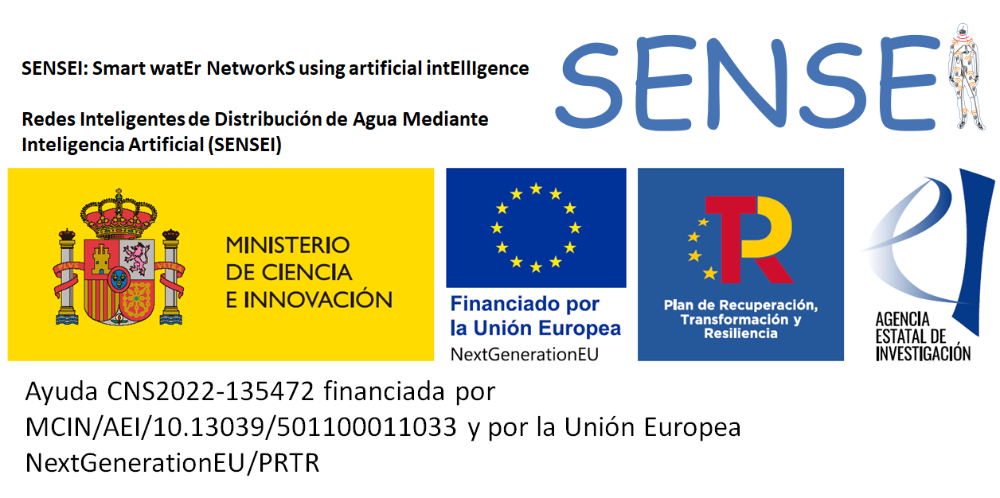

# SENSEI — Smart watEr NetworkS using artificial intEllIgence (SENSEI_Software)

[](https://doi.org/10.5281/zenodo.23087359)
[](LICENSE)

<!--
TIP: Put your funding banner at docs/funding.png (or change the path below).
Recommended size: ~1400×300 px, PNG.
-->


This repository contains the **SENSEI software** released in the context of the project:

> **SENSEI: Smart watEr NetworkS using artificial intEllIgence** (code **CNS2022-135472**), funded by **MCIN/AEI/10.13039/501100011033** and the European Union **«Next Generation EU»/PRTR**.

SENSEI provides **three executable tools** (Windows binaries) to support **model calibration** and **state estimation (SE)** for water distribution networks (EPANET `.inp` models), using measurements and/or pseudomeasurements stored in `.csv` files:

1. **Calibration** (multi-period, Levenberg–Marquardt with staged/coordinate-descent options)  
2. **Pseudo-dynamic (multiperiod) State Estimation** (sequential over time periods, Levenberg–Marquardt)  
3. **Snapshot (instantaneous) State Estimation** (single time instant, Gauss–Newton)

The included examples and configuration files allow you to **reproduce the results** in the paper below (see **Citation**).

User guides shipped with the tools are the **authoritative reference** for inputs, configuration, and expected outputs:
- Calibration guide: `Calibration_UserGuide_ENG.pdf`   
- Multiperiod SE guide: `Multiperiod_SE_UserGuide_ENG.pdf`  
- Snapshot SE guide: `Snapshot_SE_UserGuide_ENG.pdf` 

Files available in Spanish.

---

## Archived releases and persistent identifier

Every tagged release of this repository is **automatically archived in [Zenodo](https://zenodo.org/)**, which mints a persistent DOI for it. The archived record and this repository mirror each other: the Zenodo record links back here, and the DOI badge above resolves to the archive.

Two DOIs exist, and they are not interchangeable:

| DOI | Resolves to | Use it when |
|---|---|---|
| **Concept DOI** — [10.5281/zenodo.23087359](https://doi.org/10.5281/zenodo.23087359) | Always the **latest** archived version | Citing SENSEI as a tool, in general |
| **Version DOI** — e.g. [10.5281/zenodo.23087360](https://doi.org/10.5281/zenodo.23087360) for `v1.0.0` | One **specific** release | Reporting results that must be reproducible against an exact build |

The version DOI of each release is listed on its Zenodo record. For reproducibility of published results, cite the version DOI corresponding to the release you ran.

---

## Quick start (Windows)

### 1) Calibration (distributed as a ZIP)
Because of GitHub file size constraints, the **Calibration** tool is distributed as a ZIP archive.

1. Download `Calibration.zip`
2. **Extract** it (e.g., right click → *Extract All…*)
3. Open the extracted folder and run:
   - `Calibration_SENSEI.exe`

### 2) Multiperiod_SE (distributed as a ZIP)
Because of GitHub file size constraints, the **Multiperiod_SE** tool is distributed as a ZIP archive.

1. Download `Multiperiod_SE.zip`
2. **Extract** it (e.g., right click → *Extract All…*)
3. Open the extracted folder and run:
   - `Multiperiod_SE_SENSEI.exe`

### 3) Snapshot_SE (distributed as a ZIP)
Because of GitHub file size constraints, the **Snapshot_SE** tool is distributed as a ZIP archive.

1. Download `Snapshot_SE.zip`
2. **Extract** it
3. Open the extracted folder and run:
   - `Snapshot_SE_SENSEI.exe`

---

## Do / Don’t rules (important)

Each executable expects a **fixed-name configuration file** (`config_*.txt`) and relies on the provided `.dll` libraries (EPANET toolkit and linear algebra dependencies).

**Do not:**
- delete any `.dll` files,
- rename the configuration file (the `.exe` expects the exact filename),
- change the internal folder structure after extraction (paths are assumed by the executable).  

**You may:**
- modify measurement/pseudomeasurement `.csv` values,
- rename example subfolders/files **as long as you update the corresponding names inside the config `.txt`**,
- change algorithm hyperparameters in the config file (recommended only after a first run with defaults).  

---

## Repository / package layout

Top-level content:

- `Calibration.zip` — calibration tool (ZIP; extract to run)
- `Multiperiod_SE.zip` — pseudo-dynamic SE tool (ZIP; extract to run)
- `Snapshot_SE.zip` — snapshot SE tool (ZIP; extract to run)
- `docs/` — documentation assets (e.g., funding banner)
- `.zenodo.json`, `CITATION.cff` — archival and citation metadata

After extracting each ZIP, you will find:
- the executable (`*_SENSEI.exe`)
- the required `.dll` dependencies (including `epanet2.dll`)
- the fixed-name config file (`config_*.txt`)
- example folders and CSV templates
- the corresponding user guide PDF   

---

## Tool overview

### Calibration — `Calibration/`

**Purpose.** Calibrate an EPANET model using a time series of measurements/pseudomeasurements over **T periods**. The calibration can be configured in **stages** (coordinate-descent style) via an `options.csv` file.   

**What you will find (typical contents):**
- `Calibration_SENSEI.exe` (executable)
- `config_calibration.txt` (configuration; name must not change)   
- `C-town_Calib_Example/` (example dataset, including `.inp`, `.csv`, and auxiliary option files) 
- `Calibration_UserGuide_ENG.pdf`   

**Outputs.**
- Calibrated model `.inp` saved with timestamp suffix (e.g., `*_calibrated_model_YYYYMMDD_hhmmss.inp`).   
- Uncertainty propagation `.csv` (posterior CVs for optimized variables).   

---

### Multiperiod State Estimation — `Multiperiod_SE.zip` (extract to run)

**Purpose.** Estimate the most likely **state variables** over time given measurements/pseudomeasurements:
- average demands during each period,
- tank levels at the beginning of each period (and at the final instant),
and optionally pressures/flows.   

This tool runs **sequentially by period** (pseudo-dynamic): it simulates one interval at a time and carries forward relevant states.   

**Outputs.**
Saved in `PATH` with timestamps to avoid overwriting:
- `*_estimated_values_YYYYMMDD_hhmmss.csv`
- `*_normalized_residuals_YYYYMMDD_hhmmss.csv`
- `*_posterior_CV_YYYYMMDD_hhmmss.csv`  

---

### Snapshot State Estimation — `Snapshot_SE.zip` (extract to run)

**Purpose.** Instantaneous (single time) state estimation for a **single instant**, useful to see how adding/removing measurements affects the adjustment.   

**Outputs.**
A single results `.csv` saved in `PATH` with timestamp suffix:
`<info_File>_results_YYYYMMDD_hhmmss.csv` including measured values, estimated values, posterior CV and normalized residual. 

---

## Reproducing the paper results

The repository packages include:
- executables,
- example networks and measurement sets,
- fixed-name configuration files,
- and user guides.

Running the provided examples as described in each guide reproduces the experiments and outputs reported in the paper cited below.   

---

## Citation (please cite if you use SENSEI)

If you use this software (executables, configurations, examples, or derived workflows) in academic or technical work, please cite **the archived software release** and, where appropriate, **the publication describing the method**.

### Software

Mínguez, R., Peñas, C., Martínez Alzamora, F., and Montalvo, I. (2026).
**SENSEI: software for model calibration and state estimation in water distribution networks** [Computer software]. Zenodo.
https://doi.org/10.5281/zenodo.23087359

```bibtex
@software{MinguezEtAl2026SENSEIsoftware,
  title     = {{SENSEI}: software for model calibration and state estimation in water distribution networks},
  author    = {M{\'i}nguez, Roberto and Pe{\~n}as, Carlos and Mart{\'i}nez Alzamora, Fernando and Montalvo, Idel},
  year      = {2026},
  publisher = {Zenodo},
  doi       = {10.5281/zenodo.23087359},
  url       = {https://doi.org/10.5281/zenodo.23087359}
}
```

### Method

Roberto Mínguez, Carlos Peñas, Fernando Martínez Alzamora, Idel Montalvo (2026).  
**Walking towards digital twins in water distribution networks: SENSEI software tool based on state estimation.**  
*Working paper in Statistics and Econometrics* **2026-01** (ISSN 2387-0303).  
https://hdl.handle.net/10016/49039

```bibtex
@techreport{MinguezEtAl2026SENSEI,
  title       = {Walking towards digital twins in water distribution networks: SENSEI software tool based on state estimation},
  author      = {M{\'i}nguez, Roberto and Pe{\~n}as, Carlos and Mart{\'i}nez Alzamora, Fernando and Montalvo, Idel},
  year        = {2026},
  institution = {Working paper in Statistics and Econometrics},
  number      = {2026-01},
  issn        = {2387-0303},
  url         = {https://hdl.handle.net/10016/49039}
}
```

GitHub's *Cite this repository* button reads `CITATION.cff` and will produce an equivalent citation.

---

## Contact and source files

This repository primarily distributes **executables** and example datasets for replication and use.

People interested in **source files for use, improvement and/or adaptation** may contact the project leader:

**Roberto Mínguez** — rminguez@est-econ.uc3m.es

---

## License

This repository is released under the **MIT License** (see `LICENSE`).

It may include or depend on **third-party components** distributed under their own licenses; see [`THIRD_PARTY_NOTES.md`](THIRD_PARTY_NOTES.md).
